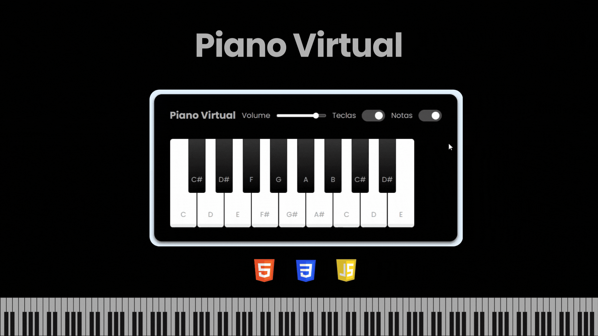

# 🎹 Piano Virtual

> Mais um projeto do Bootcamp front-end do zero da [DIO](https://web.dio.me/) em colaboração com a Ri Happy
## 👩‍💻 O projeto

🔗 [Acesse o Piano Virtual](https://codebytayne.github.io/piano-js/)

    O projeto consiste em simular um piano virtual.

## 🛠️ Tecnologias Utilizadas

- HTML
- CSS
- JavaScript 

## ⚙️ Funcionalidades

- Teclas Virtuais: Interface com teclas de piano que podem ser clicadas para tocar notas.
- Suporte para Notas: Cada tecla pode exibir a nota musical correspondente ao ser ativada a opção de "Notas"
- Controle de Volume: Slider de volume que permite ajustar o volume do som do piano.
- Exibição das Teclas: Checkbox para exibir ou ocultar as letras do teclado associadas a cada tecla do piano.

## 📂 Estrutura do Projeto

piano-js              
├─ src                
│  ├─ demo            
│  │  └─ demo.gif     
│  ├─ images          
│  │  └─ favicon.png  
│  ├─ scripts         
│  │  └─ engine.js    
│  ├─ styles          
│  │  ├─ main.css     
│  │  └─ reset.css    
│  └─ tunes           
│     ├─ ;.wav        
│     ├─ a.wav        
│     ├─ d.wav        
│     ├─ e.wav        
│     ├─ f.wav        
│     ├─ g.wav        
│     ├─ h.wav        
│     ├─ j.wav        
│     ├─ k.wav        
│     ├─ l.wav        
│     ├─ o.wav        
│     ├─ p.wav        
│     ├─ s.wav        
│     ├─ t.wav        
│     ├─ u.wav        
│     ├─ w.wav        
│     └─ y.wav        
├─ index.html         
└─ README.md          

